# SMAI -----  Assignment-2 

## 3 --- Kmeans Clustering
### 3.1 

   Implemented the K-means Clustering Class: *KMeans_me* including methods such as fit(), predict() and getCost()

   The fit() function trains the K-means model by finding the k optimal cluster centroids based on the input data.
   It is automatically called while initializing.

   The predict() method assigns a cluster number to each data point based on the optimal centroids determined by the fit() function.

   The getCost() method returns the cost of K-Means which is the Within- Cluster Sum of Squares (WCSS)

### 3.2
Elbow method
 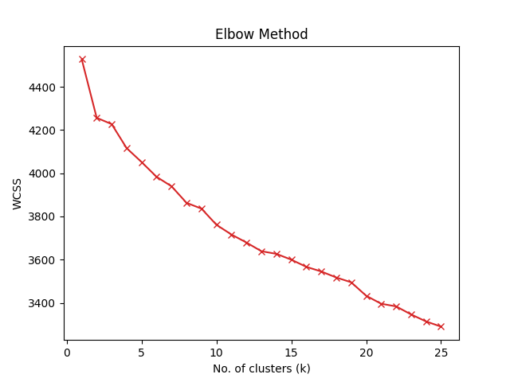

   from the elbow plot, we observe optimal k: *kkmeans1 = 2* and then I performed Kmeans clustering on the dataset using the
   number of clusters as kkmeans1.

## 4 ---  Guassian mixture models
### 4.1 

   Implemented GMM class: *GMM_me* which includes methods like fit(), getLikelihood(), getMemebership(), getParams().

### 4.2

   We compare our gmm class and the sklearn gmm class using their log_likelihood values and here found they are similar.

   AIC and BIC were computed for each value of k using the log-likelihood of the model and the number of parameters. Both criteria penalize more complex models.

   AIC = 2* num params - 2* log likelihood
   BIC = log(number of samples) * num params -  2* log likelihood

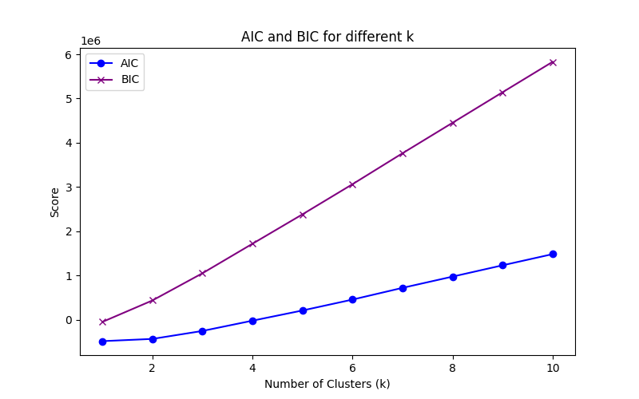
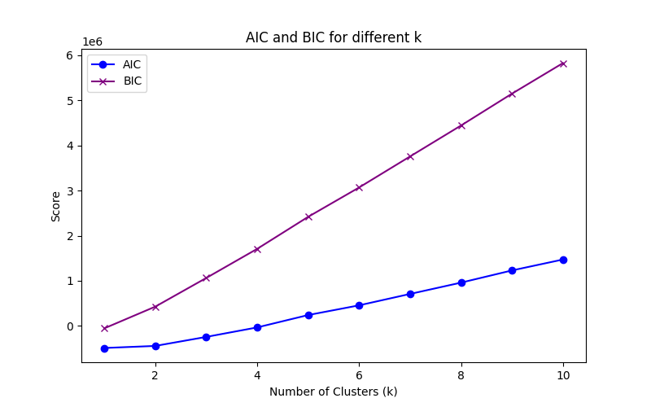

   For my GMM class and Sklearn gmm I got optimal k for both AIC and BIC as: *kgmm =1*

## 5 --- PCA
### 5.1 

   Implemented PCA class to perform dimensionality reduction and evaluate reconstruction errors.

### 5.2 

   2D PCA: Reduced data to 2 dimensions, transformed, and reconstructed it to check. 
   The reconstruction error was calculated to check the quality of the reduction.
   3D PCA: Reduced data to 3 dimensions, transformed, and reconstructed it to check. 
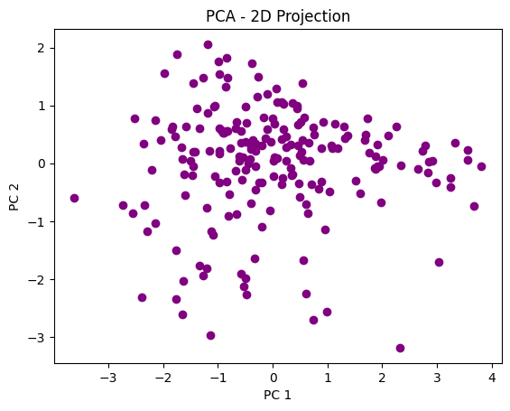
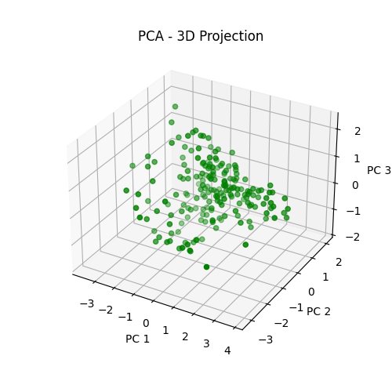

### 5.3
Data Analysis 
   Each principal component (axis) represents a combination of the original dimensions. Our original dataset has 512 dimensions, each principal component is a weighted sum of these original 512 dimensions.

   The first few principal components capture the most important patterns in the data, while the later components capture less important (or noise-like) patterns.

   The axes are uncorrelated and orthogonal with one another, meaning they provide independent views of how the data is structured. They represent the directions of maximum variance in the data. PC 1 goes by the largest amount of variance in the dataset. PC 2 and PC 3 are 2nd and 3rd largest respectively.

   By looking at the plots, I guess 2 or 3 clusters --> 3 clusters to be a good number of clusters. Thus, *k2 = 3*.

## 6 --- PCA + Clustering
### 6.1 

   Perform K-means clustering on the dataset using the number of clusters
   estimated from the 2D visualization of the dataset (k2 )
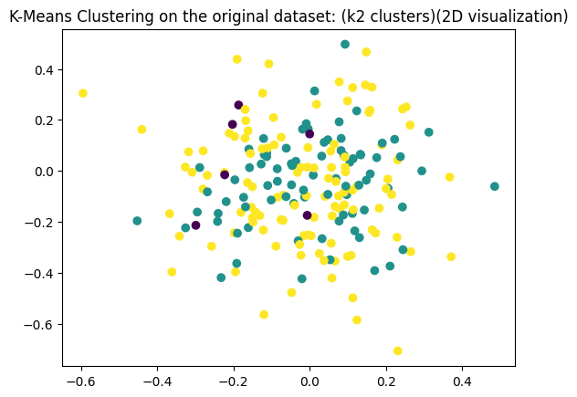
   Centroids: The centroids of the clusters are displayed in the plot.
   Cluster Labels: Each point in the 2D data is assigned to one of the 3 clusters.

### 6.2
   PCA Performed:
   Number of Components: Initial reduction to 20 components.
   Explained Variance Ratio: Visualized using a Scree Plot, indicating the proportion of 
   variance explained by each component.
   Optimal Number of Dimensions: Chosen as 5 based on the Scree Plot.

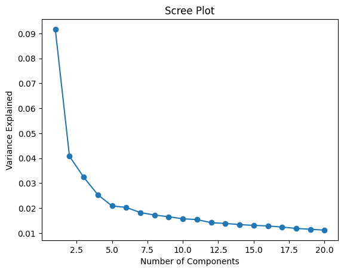
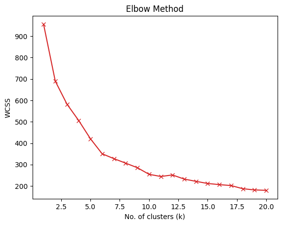

### 6.3 

   Perform GMMs on the dataset using the number of clusters estimated from the 2D visualization (k2 )
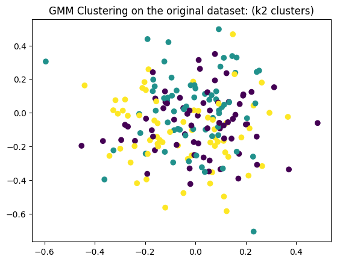

### 6.4

   PCA Reduction: Applied as before to reduce data to 5 dimensions.
   Evaluation Metrics: BIC (Bayesian Information Criterion) and AIC (Akaike Information Criterion) are computed for each k.

   From the above visualizations,
   BIC and AIC vs Number of Clusters: Plots showing the variation of BIC and AIC with different numbers of clusters.
   Optimal Clusters: Lines indicating the optimal number of clusters based on BIC and AIC are included in the plot

   *kgmm3 =1*

## 7 --- Clustering Analysis 
### 7.1 

   K-Means Cluster Analysis:

   *kkmeans1 = 2*
   *k2 = 3*
   *kkmeans3 = 6*

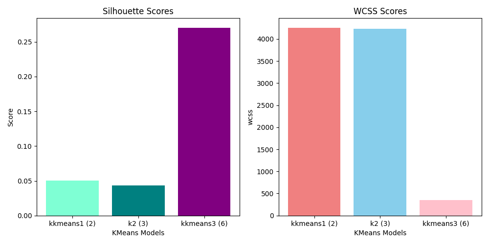

   We observe that for both WCSS and Silhoutte score kkmeans3 = 6 is best from the plot. 

### 7.2

   GMM Cluster Analysis:

   *kkmeans1 = 1*
   *k2 = 3*
   *kkmeans3 = 1*

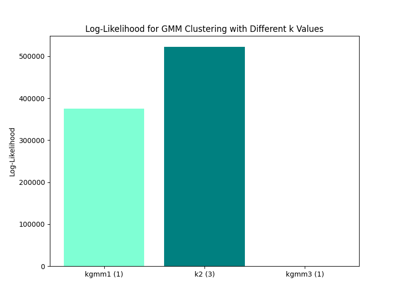

   Log-Likelihood vs Number of Clusters: Plots the log-likelihood against the number of clusters 
   to visualize how model fit changes with different cluster numbers. k2 best fits.

### 7.3

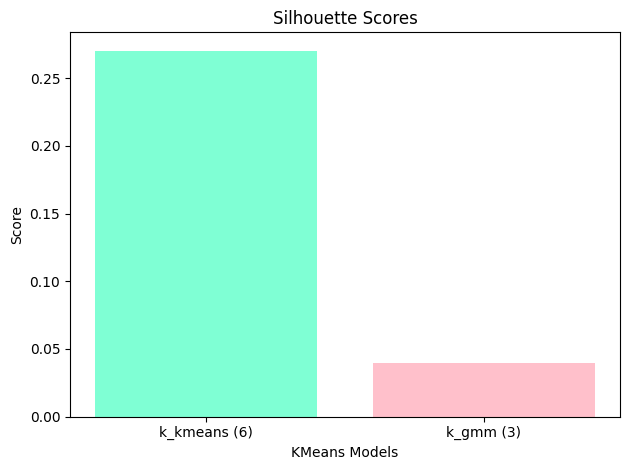

   From the plot I found that Silhoutte score is higher for kmeans = 6

## 8 --- Hirearchial Clustering
### 8.1

   Linkage Methods Tested:

   Single
   Complete
   Average
   Ward (with Euclidean distance only)

   I plotted Dendrograms for each combination of linkage method and distance metric.
   and I found that Best Linkage Method:

   Ward Linkage with Euclidean Distance was chosen based on visualization and suitability.

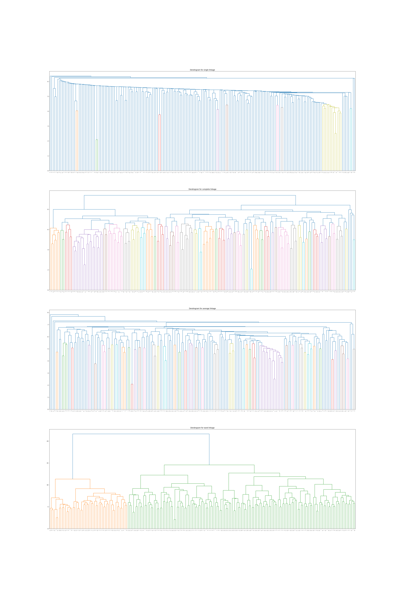

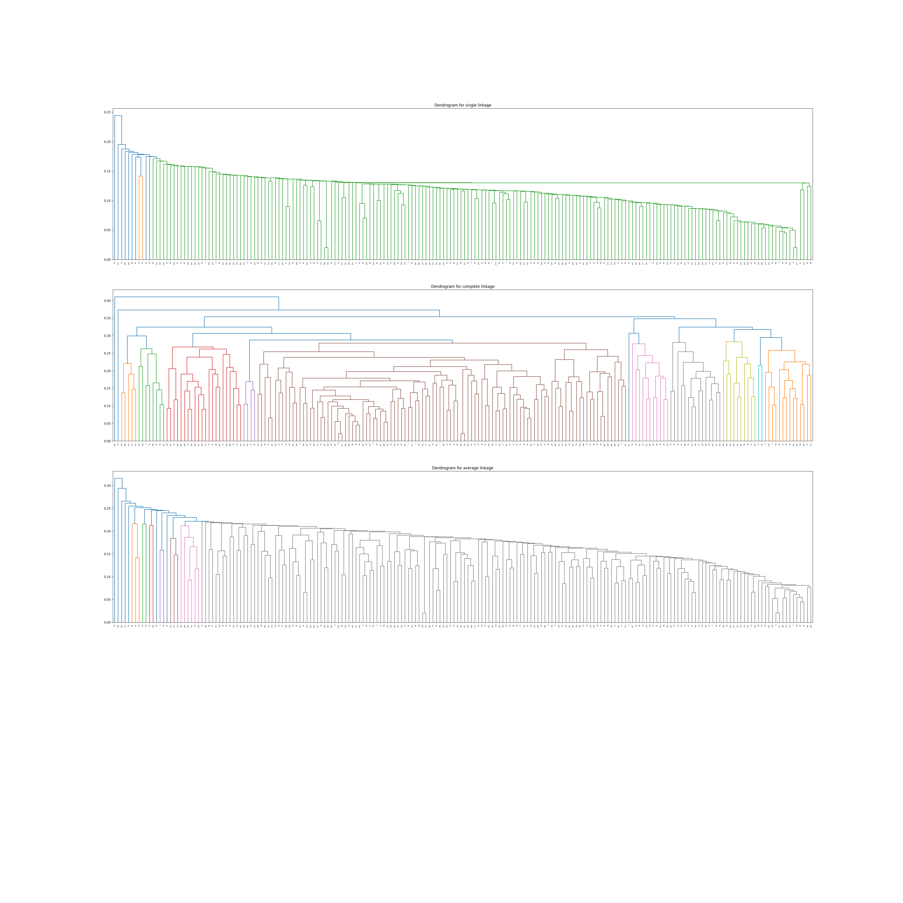

### 8.2,8.3

   Applied Hirearchial Clustering using fcluster() to obtain clusters from the dendrogram with 
   kbest1 (6 clusters) and kbest2 (3 clusters).
   K-Means Clustering: Performed with kbest1 (6 clusters).
   GMM Clustering: Applied with kbest2 (3 clusters).

   Performed visualization :
   Four scatter plots comparing clusters from Hierarchical Clustering, K-Means, and GMM on the 2D PCA-reduced data.

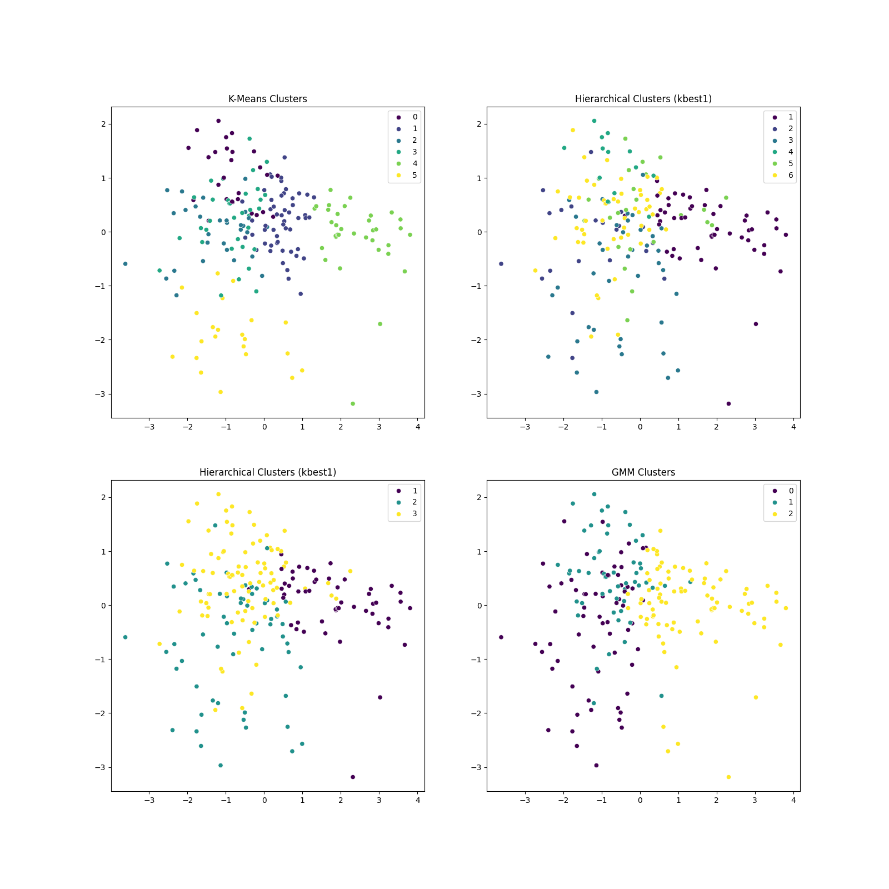

## 9 --- Nearest Neighbour Search
### 9.1 ,9.2

   I encoded categorical values and numerical features were normalised and visualised scree plot
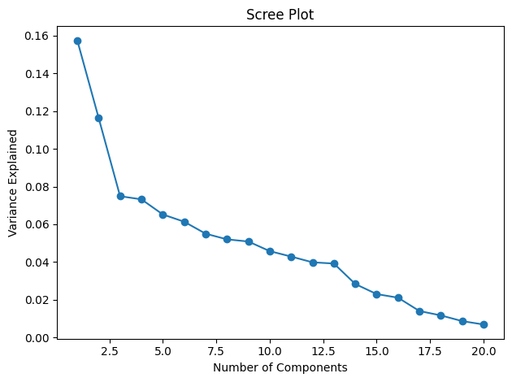

   For the previously done spotify data set my best {k,dist metrics} pair is {29,"Manhattan"}.
   So, KNN with k=29 and Manhattan distance was applied to both PCA-3D-reduced and original datasets.
   
   Here I calculated accuracy, precision, recall and F1 score for both PCA+KNN results

   PCA + KNN:

   accuracy: 0.09285299244625218
   micro: P = 0.09285299244625218 R = 0.09285299244625218 F1 = 0.09285299244625218
   macro: P = 0.05835498856828208 R = 0.06338944777122567 F1 = 0.0607681239695252

   Original:
  
   accuracy =  0.21963974433468914
   micro: P = 0.21963974433468914 R = 0.21963974433468914 F1 = 0.21963974433468914
   macro: P = 0.18015560795888133 R = 0.18956578261186552 F1 = 0.18474094107415107

   Inference Time plot:
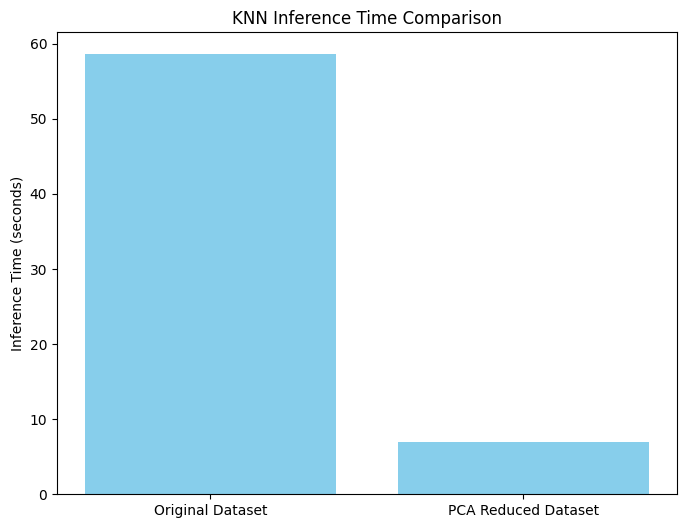

  Dimensionality reduction with PCA achieves notable improvements in inference time, making the model more efficient. However, this comes with a trade-off in classification performance. Future work should focus on optimizing the balance 
  between dimensionality reduction and model accuracy, potentially through techniques such as feature selection or advanced dimensionality reduction methods.