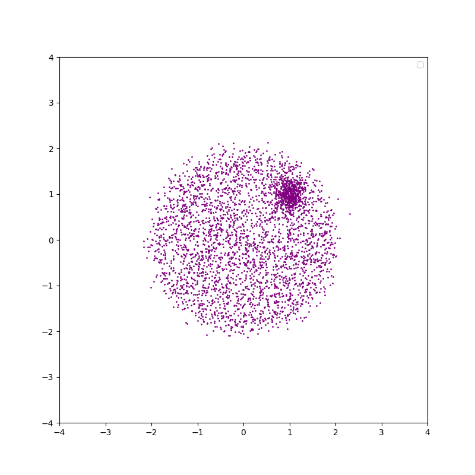
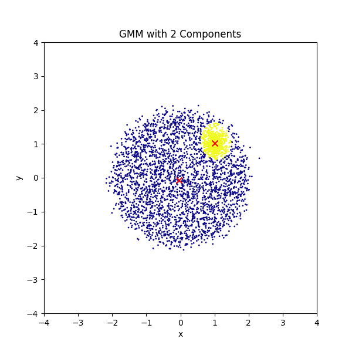
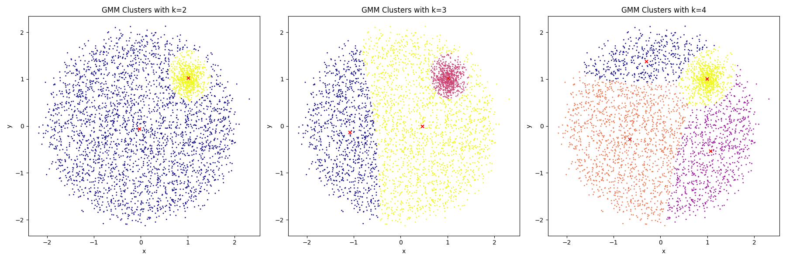
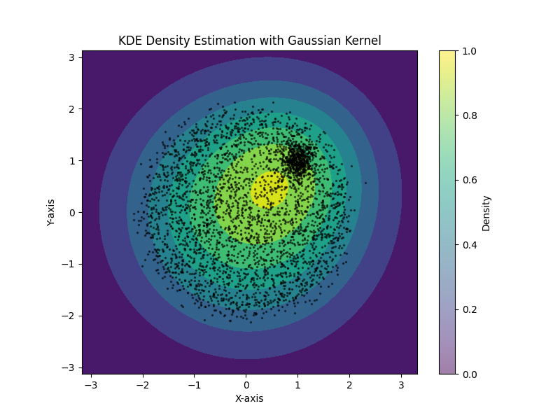
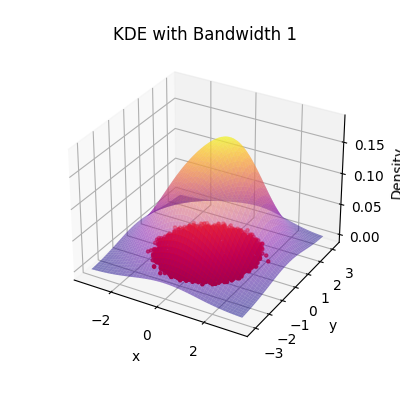
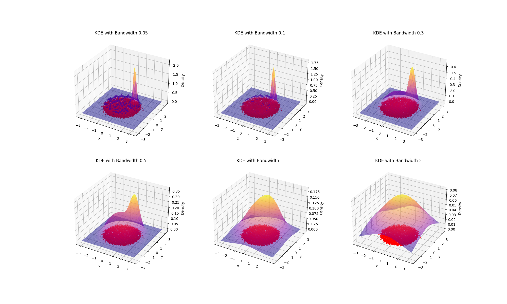
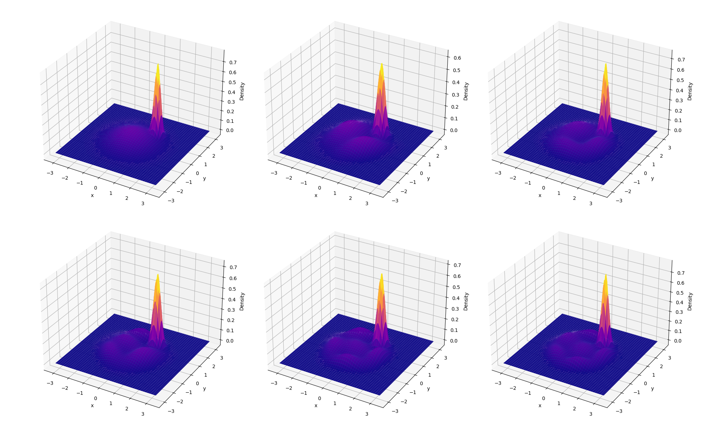
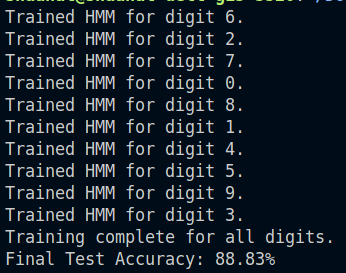
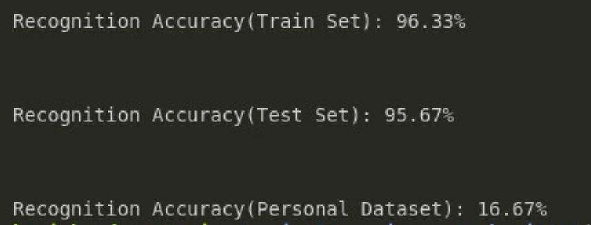

# Assignment 5 Report

## 2 KDE

### Task 1 : KDE Class
- Hyperparameters for Kernels: Implemented support for three kernels: Box, Gaussian, and Triangular.
- fit() method: This method stores the data.
- predict() method: Given a point x, it computes the density at that point using the KDE formula.
- visualize() method: For only 2D data, it will plot the KDE along with the data points.

The general formula for Kernel Density Estimation (KDE) for a given point $x$ is:

$$
\hat{f}(\mathbf{x}) = \frac{1}{n h^d} \sum_{i=1}^{n} K\left(\frac{\mathbf{x} - \mathbf{x}_i}{h}\right)
$$

Where \( n \) is the number of data points, \( h \) is the bandwidth (smoothing parameter), \( d \) is the dimensionality of the data, \( K \) is the kernel function (Gaussian, Box, Triangular), ${x}_i$ are the data points.

### 2.2 Task 2 : Generate Synthetic Data

- Generated dataset according to the given instructions.

 

### 2.3 Task 3 : KDE vs GMM

## 3 HMMs

### 3.1, 3.2 Dataset: MFCC visulization:

### 3.3 Architecture: HMM

### 3.4 Metrics

